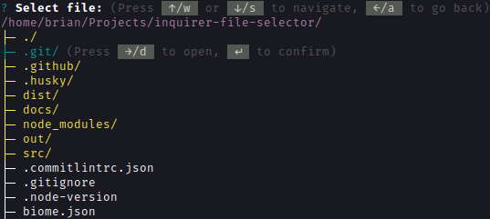

# inquirer-file-selector


A prompt implementation for [Inquirer.js](https://github.com/SBoudrias/Inquirer.js) that allows users to interactively select files or directories in the terminal.



## Features

- Selection of files and directories
- Multi-select capability
- Fully customizable theme
- Custom filters for show only specific file types
- Keybinds are fully customizable

## Installation

```sh
pnpm add inquirer-file-selector
# npm install inquirer-file-selector
```

> **NOTE**: Starting from version 1.0.0, this package requires Node.js 20 or higher. If you need to use Node.js 18, please use a 0.x.x version of this package.

## Examples

Before reviewing the examples, note that besides the prompt implementation, this package also exports types and enums you can use to customize its behavior. Here are the available exports:

```ts
// Prompt implementation
import { fileSelector } from 'inquirer-file-selector'

// Enums
import {
  Status, // Status of the prompt (e.g., idle, done, canceled)
  ItemType // Type of item to select (e.g., file, directory)
} from 'inquirer-file-selector'

// Types
import type {
  PromptConfig,
  ItemTypeUnion, // Union type of `ItemType` enum
  Keybinds,
  PromptTheme,

  StatusType, // Union type of `Status` enum
  RenderHelpContext,
  RenderItemContext,

  Item, // Resulting item type after selection
  RawItem // Raw item type before processing
} from 'inquirer-file-selector'
```

### Single-Select

```ts
const selection: Item = await fileSelector({
  message: 'Select a file or directory:'
})
```

This asks the user to select a single file or directory. The result is an `Item` object representing the selected item.

### Multi-Select

```ts
const selections: Item[] = await fileSelector({
  message: 'Select files or directories:',
  multiple: true
})
```

This allows users to select multiple files or directories. The result is an array of `Item` objects representing the selected items.

### Custom Filter

```ts
const selections: Item = await fileSelector({
  message: 'Select image file:',
  type: ItemType.File,
  filter: item => item.isDirectory || /\.(jpg|jpeg|png|gif)$/i.test(item.name)
})
```

In this example, setting the `type` option to `ItemType.File` restricts selection to files only. However, the filter function also includes directories, allowing users to navigate through them. This way, users can browse directories but can only select files that meet the filter criteria.

### Custom Theme

```ts
const selections: Item = await fileSelector({
  message: 'Select a file or directory:',
  theme: {
    style: {
      active: text => chalk.red(text)
    },
    hierarchySymbols: {
      branch: '|-',
      leaf: '\\-'
    }
  }
})
```

In the case of the theme, all properties are static. You only need to modify the properties you want to change; the rest will use the default theme. Functions like `renderItem` and `renderHelp` will use your changes without requiring you to reimplement them.

### Custom Keybinds

```ts
const selections: Item = await fileSelector({
  message: 'Select a file or directory:',
  keybinds: {
    back: ['g']
  },
  theme: {
    labels: {
      keys: {
        back: 'g'
      }
    }
  }
})
```

In this example, the keybind for navigating back to the parent directory is changed from `['left', 'a']` to `['g']`. Additionally, the theme is updated to reflect this change in the help text.

## Contributing

See the [Contributing Guide](../CONTRIBUTING.md) for details on how to contribute to this project.

## Copyright & License

© 2024 [Brian Fernandez](https://github.com/br14n-sol) (main maintainer) and contributors.

This project is licensed under the [MIT License](../LICENSE).