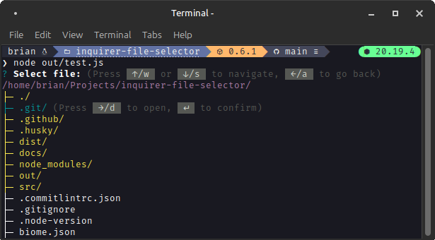

# inquirer-file-selector


A prompt implementation for [Inquirer.js](https://github.com/SBoudrias/Inquirer.js) that allows users to interactively select files or directories in the terminal.



## Features

- Selection of files and directories
- Multi-select capability
- Fully customizable theme
- Custom filters for show only specific file types
- Keybinds are fully customizable

## Installation

```sh
pnpm add inquirer-file-selector
# npm install inquirer-file-selector
```

> NOTE: From version 1.0.0, this package requires Node.js 20 or higher. If you need use Node.js 18, please use an 0.x.x version of this package.

## Usage

```ts
import {
  fileSelector,
  type Item
} from 'inquirer-file-selector'

const selection: Item = await fileSelector({
  message: 'Select a file or directory:'
})
```

## Contributing

See the [Contributing Guide](../CONTRIBUTING.md) for details on how to contribute to this project.

## Copyright & License

© 2024 [Brian Fernandez](https://github.com/br14n-sol) (main maintainer) and contributors.

This project is licensed under the [MIT License](../LICENSE).