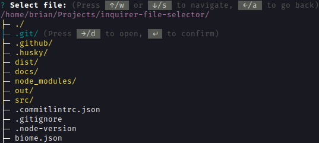

# inquirer-file-selector


A file selector prompt for [Inquirer.js](https://github.com/SBoudrias/Inquirer.js) that allows users to interactively select files or directories from the terminal.



## Features

- File and directory selection
- Multi-select support
- Custom filters to show only specific file types
- Restrict back navigation to a specific parent directory
- Cancel selection with a key press (configurable)
- Fully customizable keybinds
- Fully customizable theme

## Installation

```sh
pnpm add inquirer-file-selector
```

## Exports

In addition to the prompt, the package exports several types and constants for customization:

```ts
import { fileSelector } from 'inquirer-file-selector'

// Constants
import {
  Status, // Status of the prompt (e.g., idle, done, canceled)
  ItemType // Type of item to select (e.g., file, directory)
} from 'inquirer-file-selector'

// Types
import type {
  PromptConfig,
  PromptTheme,

  // Theme-related types
  RenderHelpOptions,
  HeaderHelpContext,
  InlineHelpContext,
  RenderItemContext,

  Item // Resulting item type after selection
} from 'inquirer-file-selector'
```

## Examples

### Single Selection

```ts
const selection = await fileSelector({
  message: 'Select a file or directory:'
})
```

This asks the user to select a single file or directory. The prompt returns the selected `Item`.

### Multiple Selection

```ts
const selections = await fileSelector({
  message: 'Select files or directories:',
  multiple: true
})
```

This enables selecting multiple files or directories. The prompt returns an array of selected `Item` objects.

### Restricting Selection to a Specific Type

```ts
const selection = await fileSelector({
  message: 'Select any file:',
  type: ItemType.File
})
```
The `type` option controls what can be selected, without affecting which items are displayed. Even when `ItemType.File` is set, directories are still displayed so users can continue navigating the file system.

### Filtering Displayed Items

```ts
const selection = await fileSelector({
  message: 'Select image file:',
  filter: item => item.isDirectory || /\.(jpg|jpeg|png|gif)$/i.test(item.name)
})
```

The `filter` function controls which items are displayed. In this example, directories remain visible, while files that do not match the regex are filtered out of the list.

### Customizing the Theme

```ts
const selection = await fileSelector({
  message: 'Select a file or directory:',
  theme: {
    style: {
      active: text => styleText('red', text)
    },
    hierarchySymbols: {
      branch: '|-',
      leaf: '\\-'
    }
  }
})
```
Theme objects are merged with the default theme, so you only need to override the properties you want to customize. Functions such as `renderItem` and `renderHelp` automatically use your custom theme.

### Customizing Keybinds

```ts
const selection = await fileSelector({
  message: 'Select a file or directory:',
  keybinds: {
    back: ['g']
  },
  theme: {
    labels: {
      keys: {
        back: 'g'
      }
    }
  }
})
```

In this example, the keybind for navigating back to the parent directory is changed from `['left', 'a']` to `['g']`. The theme is also updated so the help text reflects the new keybinding.

## Contributing

See the [Contributing Guide](../CONTRIBUTING.md) for details on how to contribute to this project.

## Copyright & License

© 2024 [Brian Fernandez](https://github.com/br14n-sol) (main maintainer) and contributors.

This project is licensed under the [MIT License](../LICENSE).