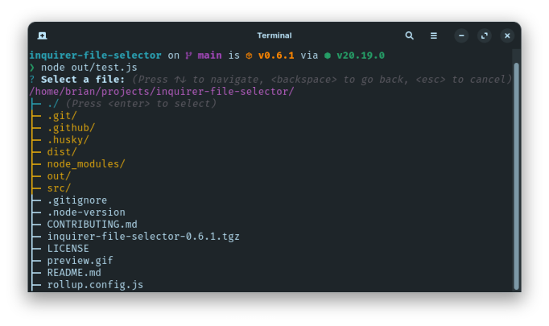

# inquirer-file-selector


A prompt implementation for [Inquirer.js](https://github.com/SBoudrias/Inquirer.js) that allows users to interactively select files or directories in the terminal.



## Key Features

- **File & Directory Selection** – Browse and select files from the terminal.
- **Multiple Selection** – Select multiple files at once. **(not ready)**
- **Custom Filters** – Apply filters to show only specific file types.
- **Keyboard Navigation** – Use arrow keys for easy selection.
- **Theming** – Customize the appearance of the prompt.

## Installation

<table>
  <thead>
    <tr>
      <th>pnpm (recommended)</th>
      <th>npm</th>
    </tr>
  </thead>
  <tbody>
  <tr>
  <td>

```sh
pnpm add inquirer-file-selector
```

  </td>
  <td>

```sh
npm install inquirer-file-selector
```

  </td>
  </tr>
  </tbody>
</table>

## Usage

```ts
import {
  fileSelector,
  type Item
} from 'inquirer-file-selector'

const selection: Item = await fileSelector({
  message: 'Select a file or directory:'
})
```

## Documentation

See the full documentation in the [docs/](docs/) directory:

- [Getting Started](docs/getting-started.md) **(not ready)**
- [Theming](docs/theming.md) **(not ready)**
- [Examples](docs/examples.md) **(not ready)**

## Contributing

Contributions are welcome! See [CONTRIBUTING.md](CONTRIBUTING.md) for more information.

## Copyright & License

© 2024 [Brian Fernandez](https://github.com/br14n-sol) and Contributors.

This project is licensed under the MIT license. See the file [LICENSE](LICENSE) for details.
